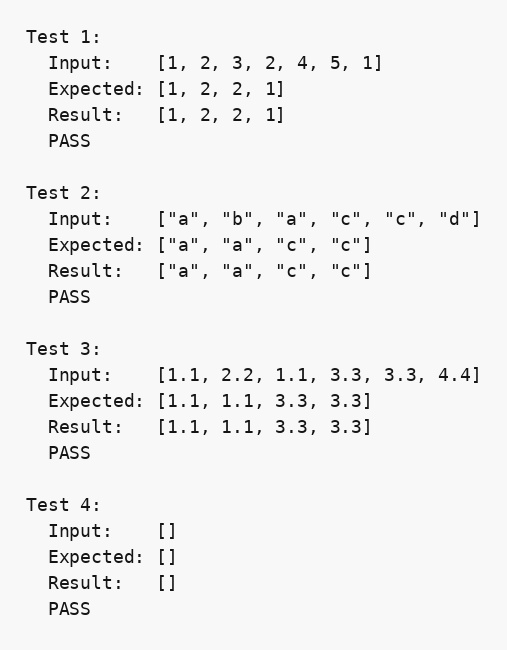

## Парадигма функціонального програмування, мова Хаскель

### Розділ 1. Варіант 26

### Умова задачі
*Вилучити зі списку елементи, що мають непарну кількість входжень у список.*

### Код програми
```haskell
-- part 1 (I-a). 26
-- Вилучити зі списку елементи, що мають непарну кількість входжень у список.
import Data.List (intercalate)

count :: Eq a => a -> [a] -> Int
count x = length . filter (== x)

removeOddOccurrences :: Eq a => [a] -> [a]
removeOddOccurrences arr = filter (\x -> even (count x arr)) arr

parseInput :: Read a => String -> [a]
parseInput = map read . words

showArray :: Show a => [a] -> String
showArray arr = "[" ++ intercalate ", " (map show arr) ++ "]"

runTest :: (Eq a, Show a) => Int -> [a] -> [a] -> IO ()
runTest n input expected = do
    let result = removeOddOccurrences input
    putStrLn $ "Test " ++ show n ++ ":"
    putStrLn $ "  Input:    " ++ showArray input
    putStrLn $ "  Expected: " ++ showArray expected
    putStrLn $ "  Result:   " ++ showArray result
    putStrLn $ if result == expected then "  PASS\n" else "  FAIL\n"

main :: IO ()
main = do
    runTest 1 [1,2,3,2,4,5,1] ([1,2,2,1] :: [Int])
    runTest 2 ["a","b","a","c","c","d"] ["a","a","c","c"]
    runTest 3 [1.1,2.2,1.1,3.3,3.3,4.4] ([1.1,1.1,3.3,3.3] :: [Double])
    runTest 4 ([] :: [Int]) []
```

### Опис алгоритму

Функція `removeOddOccurrences` послідовно фільтрує початковий список. Для кожного елемента `x` функція `count` підраховує кількість його входжень у повний початковий список. Елемент залишається у результаті лише тоді, коли знайдена кількість є парною.

Такий підхід зберігає початковий порядок елементів і всі копії значень із парною частотою. Для списку довжини `n` фільтрація виконує `n` підрахунків, кожен з яких переглядає список, тому часова складність становить `O(n²)`, а додаткова просторова складність — `O(n)` для результату.

### Обґрунтування завершуваності

Функції `filter` і `length` працюють зі скінченним вхідним списком. Під час кожного підрахунку `count` список повністю переглядається і стає коротшим на один елемент. Зовнішня фільтрація також обробляє кожен елемент рівно один раз, тому алгоритм завершується для будь-якого скінченного списку.

### Опис процесу виконання

1. Береться черговий елемент початкового списку.
2. У повному списку підраховується кількість входжень цього елемента.
3. Якщо кількість парна, елемент додається до результату; інакше він відкидається.
4. Кроки повторюються до завершення списку.

### Умови тестів

1. Змішаний список цілих чисел перевіряє одночасне вилучення значень із непарною частотою та збереження порядку інших елементів.
2. Список рядків перевіряє поліморфність функції для довільного типу з операцією рівності.
3. Список дробових чисел перевіряє роботу з іншим числовим типом.
4. Порожній список перевіряє граничний випадок.

### Результати тестів

