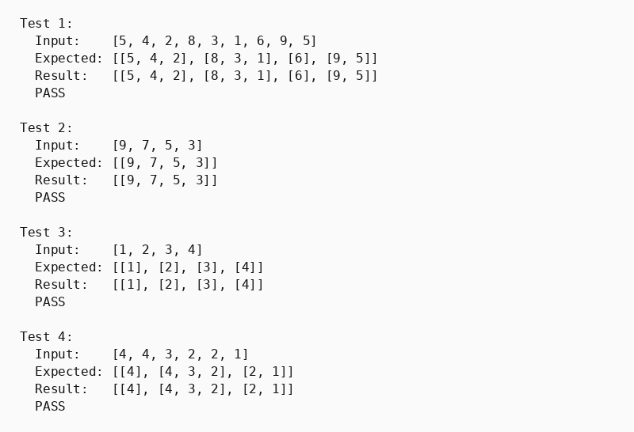

## Парадигма функціонального програмування, мова Хаскель

### Розділ 2. Варіант 1

### Умова задачі
*Розбити список на впорядковані за спаданням підсписки із збереженням порядку слідування елементів.*

### Код програми
```haskell
-- part 2. 1
-- Розбити список на впорядковані за спаданням підсписки.
import Data.List (intercalate)

splitDescending :: Ord a => [a] -> [[a]]
splitDescending [] = []
splitDescending (x:xs) = reverse (map reverse (go xs [[x]]))
  where
    go [] acc = acc
    go (y:ys) (current@(prev:_):rest)
        | prev > y  = go ys ((y:current):rest)
        | otherwise = go ys ([y]:current:rest)
    go _ [] = []

showArray :: Show a => [a] -> String
showArray arr = "[" ++ intercalate ", " (map show arr) ++ "]"

show2DArray :: Show a => [[a]] -> String
show2DArray arr = "[" ++ intercalate ", " (map showArray arr) ++ "]"

runTest :: (Ord a, Show a, Eq a) => Int -> [a] -> [[a]] -> IO ()
runTest n input expected = do
    let result = splitDescending input
    putStrLn $ "Test " ++ show n ++ ":"
    putStrLn $ "  Input:    " ++ showArray input
    putStrLn $ "  Expected: " ++ show2DArray expected
    putStrLn $ "  Result:   " ++ show2DArray result
    putStrLn $ if result == expected then "  PASS\n" else "  FAIL\n"

main :: IO ()
main = do
    runTest 1 [5,4,2,8,3,1,6,9,5]
        ([[5,4,2], [8,3,1], [6], [9,5]] :: [[Int]])

    runTest 2 [9,7,5,3]
        ([[9,7,5,3]] :: [[Int]])

    runTest 3 [1,2,3,4]
        ([[1], [2], [3], [4]] :: [[Int]])

    runTest 4 [4,4,3,2,2,1]
        ([[4], [4,3,2], [2,1]] :: [[Int]])
```

### Результати тестів

