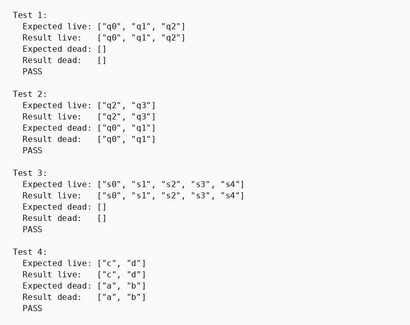

## Парадигма функціонального програмування, мова Хаскель

### Розділ 3. Варіант 2, задача 1

### Умова задачі
*Виявити живі та мертві стани скінченого автомату.*

### Код програми
```haskell
-- part 3. Variant 2, task 1
-- Виявити живі та мертві стани скінченого автомату.
import Data.List (intercalate, nub, sort, (\\))

data Automaton q s = Automaton
  { states       :: [q]
  , transitions  :: [(q, s, q)]
  , finalStates  :: [q]
  }

fixPoint :: Eq a => (a -> a) -> a -> a
fixPoint f x =
    let x' = f x
    in if x == x' then x else fixPoint f x'

liveStates :: Ord q => Automaton q s -> [q]
liveStates a = sort $ fixPoint step (sort (finalStates a))
  where
    step live = sort . nub $ live ++ [p | (p, _, q) <- transitions a, q `elem` live]

deadStates :: Ord q => Automaton q s -> [q]
deadStates a = sort (states a) \\ liveStates a

showArray :: Show a => [a] -> String
showArray arr = "[" ++ intercalate ", " (map show arr) ++ "]"

runTest :: Int -> Automaton String Char -> [String] -> [String] -> IO ()
runTest n automaton expectedLive expectedDead = do
    let live = liveStates automaton
    let dead = deadStates automaton
    putStrLn $ "Test " ++ show n ++ ":"
    putStrLn $ "  Expected live: " ++ showArray expectedLive
    putStrLn $ "  Result live:   " ++ showArray live
    putStrLn $ "  Expected dead: " ++ showArray expectedDead
    putStrLn $ "  Result dead:   " ++ showArray dead
    putStrLn $ if live == expectedLive && dead == expectedDead then "  PASS\n" else "  FAIL\n"

aut1 :: Automaton String Char
aut1 = Automaton
    ["q0", "q1", "q2"]
    [("q0", 'a', "q1"), ("q1", 'b', "q2")]
    ["q2"]

aut2 :: Automaton String Char
aut2 = Automaton
    ["q0", "q1", "q2", "q3"]
    [("q0", 'a', "q1"), ("q1", 'a', "q1"), ("q2", 'b', "q3")]
    ["q3"]

aut3 :: Automaton String Char
aut3 = Automaton
    ["s0", "s1", "s2", "s3", "s4"]
    [("s0", 'a', "s1"), ("s1", 'b', "s2"), ("s2", 'b', "s2"), ("s3", 'c', "s4")]
    ["s2", "s4"]

aut4 :: Automaton String Char
aut4 = Automaton
    ["a", "b", "c", "d"]
    [("a", '0', "b"), ("b", '1', "a"), ("c", '0', "d")]
    ["d"]

main :: IO ()
main = do
    runTest 1 aut1 ["q0", "q1", "q2"] []
    runTest 2 aut2 ["q2", "q3"] ["q0", "q1"]
    runTest 3 aut3 ["s0", "s1", "s2", "s3", "s4"] []
    runTest 4 aut4 ["c", "d"] ["a", "b"]
```

### Опис алгоритму

Живим вважається стан, з якого існує шлях хоча б до одного заключного стану. Спочатку до множини живих станів додаються всі заключні стани. Далі функція `step` знаходить усі переходи, що ведуть у вже відомі живі стани, та додає їхні початкові стани.

Функція `fixPoint` повторює цей крок, доки множина живих станів перестане змінюватися. Мертві стани визначаються як різниця між повною множиною станів автомата і знайденими живими станами.

### Обґрунтування завершуваності

Автомат містить скінченну кількість станів. На кожній результативній ітерації до множини живих станів додається щонайменше один новий стан, а вже додані стани не вилучаються. Тому кількість результативних ітерацій не перевищує кількості станів автомата, після чого досягається нерухома точка.

### Опис ітеративного процесу

1. Нульова ітерація: множина живих станів дорівнює множині заключних станів.
2. На черговій ітерації переглядаються всі переходи `p --s--> q`.
3. Якщо `q` вже живий, стан `p` також додається до множини живих.
4. Ітерації повторюються, доки нові стани більше не додаються.
5. Усі стани поза отриманою множиною позначаються як мертві.

### Умови тестів

1. Лінійний автомат перевіряє, що всі попередники заключного стану стають живими.
2. Недосяжна від фіналу компонента з циклом перевіряє визначення мертвих станів.
3. Автомат із двома заключними станами перевіряє об'єднання зворотної досяжності від кількох цілей.
4. Окремий цикл без шляху до заключного стану перевіряє, що сам цикл не робить стани живими.

### Результати тестів

