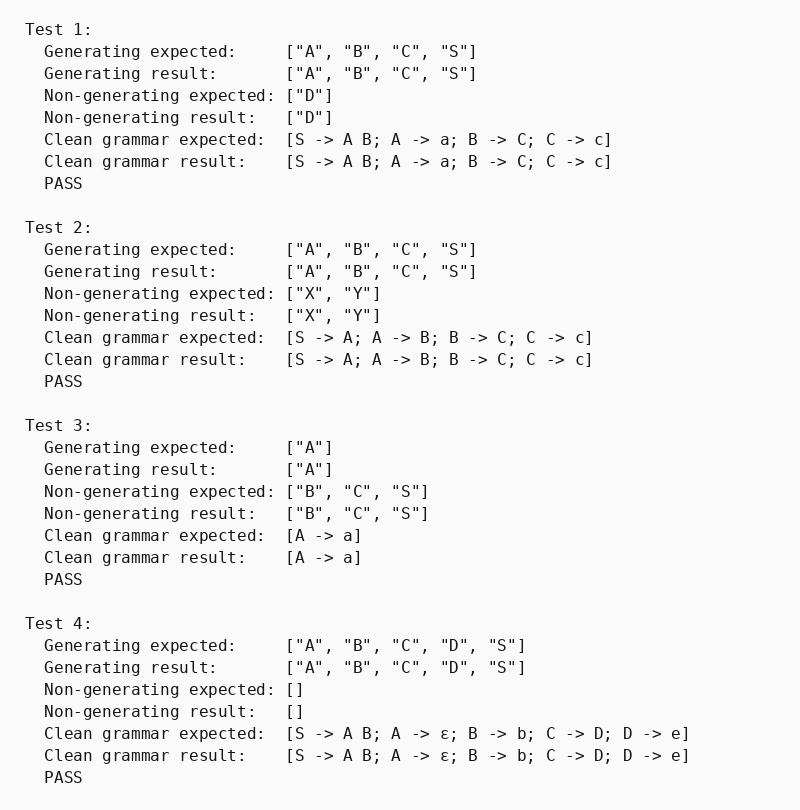

## Парадигма функціонального програмування, мова Хаскель

### Розділ 4. Варіант 2, задача 1

### Умова задачі
*Виявити породжуючі та непороджуючі нетермінали. Виконати вилучення непороджуючих символів як перетворення, еквівалентне за мовою відносно стартового символу.*

### Код програми
```haskell
-- part 4. Variant 2, task 1
-- Виявити породжуючі та непороджуючі нетермінали. Елімінувати непороджуючі нетермінали.
import Data.List (intercalate, nub, sort, (\\))

data Symbol = T String | NT String deriving (Eq, Ord)
type Rule = (String, [Symbol])
type Grammar = [Rule]

instance Show Symbol where
    show (T s) = s
    show (NT s) = s

fixPoint :: Eq a => (a -> a) -> a -> a
fixPoint f x =
    let x' = f x
    in if x == x' then x else fixPoint f x'

rhsNonterminals :: [Symbol] -> [String]
rhsNonterminals rhs = [n | NT n <- rhs]

allNonterminals :: Grammar -> [String]
allNonterminals g = sort . nub $ [lhs | (lhs, _) <- g] ++ concatMap (rhsNonterminals . snd) g

isGeneratingSymbol :: [String] -> Symbol -> Bool
isGeneratingSymbol _ (T _) = True
isGeneratingSymbol generating (NT n) = n `elem` generating

generatingNonterminals :: Grammar -> [String]
generatingNonterminals g = fixPoint step []
  where
    step current = sort . nub $ current ++
        [lhs | (lhs, rhs) <- g, all (isGeneratingSymbol current) rhs]

nonGeneratingNonterminals :: Grammar -> [String]
nonGeneratingNonterminals g = allNonterminals g \\ generatingNonterminals g

eliminateNonGenerating :: String -> Grammar -> Grammar
eliminateNonGenerating start g =
    let gen = generatingNonterminals g
    in if start `notElem` gen
        then []
        else [(lhs, rhs) | (lhs, rhs) <- g,
            lhs `elem` gen,
            all (isGeneratingSymbol gen) rhs]

showArray :: Show a => [a] -> String
showArray arr = "[" ++ intercalate ", " (map show arr) ++ "]"

showRule :: Rule -> String
showRule (lhs, []) = lhs ++ " -> ε"
showRule (lhs, rhs) = lhs ++ " -> " ++ unwords (map show rhs)

showGrammar :: Grammar -> String
showGrammar g = "[" ++ intercalate "; " (map showRule g) ++ "]"

runTest :: Int -> String -> Grammar -> [String] -> [String] -> Grammar -> IO ()
runTest n start grammar expectedGen expectedNonGen expectedClean = do
    let gen = generatingNonterminals grammar
    let nonGen = nonGeneratingNonterminals grammar
    let clean = eliminateNonGenerating start grammar
    putStrLn $ "Test " ++ show n ++ ":"
    putStrLn $ "  Start symbol:            " ++ start
    putStrLn $ "  Generating expected:     " ++ showArray expectedGen
    putStrLn $ "  Generating result:       " ++ showArray gen
    putStrLn $ "  Non-generating expected: " ++ showArray expectedNonGen
    putStrLn $ "  Non-generating result:   " ++ showArray nonGen
    putStrLn $ "  Clean grammar expected:  " ++ showGrammar expectedClean
    putStrLn $ "  Clean grammar result:    " ++ showGrammar clean
    putStrLn $ if gen == expectedGen && nonGen == expectedNonGen && clean == expectedClean then "  PASS\n" else "  FAIL\n"

grammar1 :: Grammar
grammar1 =
    [ ("S", [NT "A", NT "B"])
    , ("A", [T "a"])
    , ("B", [NT "C"])
    , ("C", [T "c"])
    , ("D", [NT "D"])
    ]

grammar2 :: Grammar
grammar2 =
    [ ("S", [NT "A"])
    , ("A", [NT "B"])
    , ("B", [NT "C"])
    , ("C", [T "c"])
    , ("X", [NT "Y"])
    , ("Y", [NT "X"])
    ]

grammar3 :: Grammar
grammar3 =
    [ ("S", [NT "A", NT "B"])
    , ("A", [T "a"])
    , ("B", [NT "C"])
    , ("C", [NT "B"])
    ]

grammar4 :: Grammar
grammar4 =
    [ ("S", [NT "A", NT "B"])
    , ("A", [])
    , ("B", [T "b"])
    , ("C", [NT "D"])
    , ("D", [T "e"])
    ]

main :: IO ()
main = do
    runTest 1 "S" grammar1
        ["A", "B", "C", "S"] ["D"]
        [("S", [NT "A", NT "B"]), ("A", [T "a"]), ("B", [NT "C"]), ("C", [T "c"])]

    runTest 2 "S" grammar2
        ["A", "B", "C", "S"] ["X", "Y"]
        [("S", [NT "A"]), ("A", [NT "B"]), ("B", [NT "C"]), ("C", [T "c"])]

    runTest 3 "S" grammar3
        ["A"] ["B", "C", "S"]
        []

    runTest 4 "S" grammar4
        ["A", "B", "C", "D", "S"] []
        grammar4
```

### Опис алгоритму

Породжуючим є нетермінал, з якого можна вивести рядок, що складається лише з терміналів. Алгоритм починає з порожньої множини породжуючих нетерміналів. На кожній ітерації до неї додаються ліві частини правил, у правій частині яких усі символи є терміналами або вже відомими породжуючими нетерміналами.

Після досягнення нерухомої точки непороджуючі нетермінали визначаються як різниця між усіма нетерміналами граматики та породжуючими. Функція `eliminateNonGenerating` додатково отримує стартовий символ. Якщо він непороджуючий, мова граматики порожня і результатом є порожній набір правил. Інакше залишаються тільки правила з породжуючою лівою частиною та породжуючими символами у правій частині.

### Обґрунтування завершуваності

Множина нетерміналів граматики скінченна. Функція `step` лише додає елементи до поточної множини і ніколи їх не вилучає. Тому після не більш ніж `|N|` результативних розширень множина перестане змінюватися, а `fixPoint` завершить роботу.

### Опис ітеративного процесу

1. Початкова множина породжуючих нетерміналів є порожньою.
2. Переглядаються всі правила граматики.
3. Ліва частина правила додається до множини, якщо вся права частина вже може породити термінальний рядок.
4. Перегляд повторюється до відсутності змін.
5. Якщо стартовий символ непороджуючий, повертається порожня граматика; інакше правила, пов'язані з непороджуючими нетерміналами, вилучаються.

### Тестові сценарії

| Вхідні дані | Очікуваний результат | Що перевіряє тест |
|---|---|---|
| `grammar1`, старт `S` | Вилучено лише `D -> D` | Окремий саморекурсивний непороджуючий нетермінал |
| `grammar2`, старт `S` | Вилучено цикл `X <-> Y` | Взаємно рекурсивна компонента без термінального завершення |
| `grammar3`, старт `S` | Порожній набір правил | Стартовий символ непороджуючий, тому мова порожня; правило `A -> a` не залишається окремо |
| `grammar4`, старт `S` | Граматика не змінюється | `ε`-правило та повністю породжуюча граматика |

### Ілюстрація результатів тестування

Зображення є ілюстрацією одного запуску. Актуальна перевірка виконується командою `runghc main.hs`.


