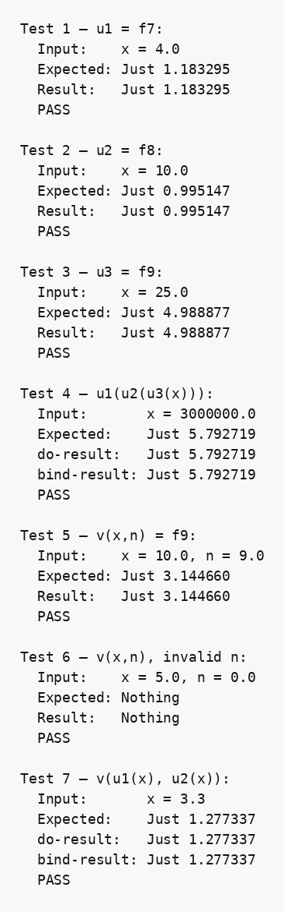

## Парадигма функціонального програмування, мова Хаскель

### Розділ 5. Варіант (7, 8, 9), n = 9

### Умова задачі
*Запрограмувати Maybe-функції для f7, f8, f9; реалізувати суперпозиції u1(u2(u3(x))) та v(u1(x), u2(x)) з do-нотацією і без неї.*

Використані функції при `n = 9`:

- `f7(x) = 1 / lg(x² - n)`;
- `f8(x) = lg(x - 1/n)`;
- `f9(x) = sqrt(x - 1/n)`;
- `u1 = f7`, `u2 = f8`, `u3 = f9`;
- допоміжна двоаргументна функція `v(y, z) = sqrt(y - 1/z)`.

Другий аргумент `v` позначено як `z`, оскільки в суперпозиції `v(u1(x), u2(x))` до нього передається результат `u2(x)`, а не стала `n`.

### Код програми
```haskell
-- part 5. Variant (7, 8, 9), n = 9
-- Maybe-функції для виразів:
-- f7(x) = 1 / lg(x^2 - n)
-- f8(x) = lg(x - 1/n)
-- f9(x) = sqrt(x - 1/n)
import Text.Printf (printf)

nValue :: Double
nValue = 9.0

eps :: Double
eps = 1e-9

safeLog10 :: Double -> Maybe Double
safeLog10 x
    | x > 0     = Just (logBase 10 x)
    | otherwise = Nothing

safeSqrt :: Double -> Maybe Double
safeSqrt x
    | x >= 0    = Just (sqrt x)
    | otherwise = Nothing

safeDiv :: Double -> Double -> Maybe Double
safeDiv _ y | abs y < eps = Nothing
safeDiv x y = Just (x / y)

-- u1(x) = f7(x) = 1 / lg(x^2 - n), n = 9
u1 :: Double -> Maybe Double
u1 x = do
    logarithm <- safeLog10 (x * x - nValue)
    safeDiv 1 logarithm

-- u2(x) = f8(x) = lg(x - 1/n), n = 9
u2 :: Double -> Maybe Double
u2 x = safeLog10 (x - 1 / nValue)

-- u3(x) = f9(x) = sqrt(x - 1/n), n = 9
u3 :: Double -> Maybe Double
u3 x = safeSqrt (x - 1 / nValue)

-- u1(u2(u3(x))) з do-нотацією
compositionDo :: Double -> Maybe Double
compositionDo x = do
    a <- u3 x
    b <- u2 a
    u1 b

-- u1(u2(u3(x))) без do-нотації
compositionBind :: Double -> Maybe Double
compositionBind x = u3 x >>= u2 >>= u1

-- v(y, z) = sqrt(y - 1/z)
v :: Double -> Double -> Maybe Double
v _ z | abs z < eps = Nothing
v y z = safeSqrt (y - 1 / z)

-- v(u1(x), u2(x)) з do-нотацією
composition2Do :: Double -> Maybe Double
composition2Do x = do
    a <- u1 x
    b <- u2 x
    v a b

-- v(u1(x), u2(x)) без do-нотації
composition2Bind :: Double -> Maybe Double
composition2Bind x = u1 x >>= \a -> u2 x >>= \b -> v a b

formatMaybe :: Maybe Double -> String
formatMaybe Nothing = "Nothing"
formatMaybe (Just x) = "Just " ++ printf "%.6f" x

approxMaybe :: Maybe Double -> Maybe Double -> Bool
approxMaybe Nothing Nothing = True
approxMaybe (Just a) (Just b) = abs (a - b) < 1e-6
approxMaybe _ _ = False

runUnaryTest :: Int -> String -> (Double -> Maybe Double) -> Double -> Maybe Double -> IO ()
runUnaryTest number name fn x expected = do
    let result = fn x
    putStrLn $ "Test " ++ show number ++ " — " ++ name ++ ":"
    putStrLn $ "  Input:    x = " ++ show x
    putStrLn $ "  Expected: " ++ formatMaybe expected
    putStrLn $ "  Result:   " ++ formatMaybe result
    putStrLn $ if approxMaybe result expected then "  PASS\n" else "  FAIL\n"

runBinaryTest :: Int -> String -> (Double -> Double -> Maybe Double) -> Double -> Double -> Maybe Double -> IO ()
runBinaryTest number name fn y z expected = do
    let result = fn y z
    putStrLn $ "Test " ++ show number ++ " — " ++ name ++ ":"
    putStrLn $ "  Input:    y = " ++ show y ++ ", z = " ++ show z
    putStrLn $ "  Expected: " ++ formatMaybe expected
    putStrLn $ "  Result:   " ++ formatMaybe result
    putStrLn $ if approxMaybe result expected then "  PASS\n" else "  FAIL\n"

runPairTest :: Int -> String -> (Double -> Maybe Double) -> (Double -> Maybe Double) -> Double -> Maybe Double -> IO ()
runPairTest number name fnDo fnBind x expected = do
    let resultDo = fnDo x
    let resultBind = fnBind x
    putStrLn $ "Test " ++ show number ++ " — " ++ name ++ ":"
    putStrLn $ "  Input:       x = " ++ show x
    putStrLn $ "  Expected:    " ++ formatMaybe expected
    putStrLn $ "  do-result:   " ++ formatMaybe resultDo
    putStrLn $ "  bind-result: " ++ formatMaybe resultBind
    putStrLn $ if approxMaybe resultDo expected && approxMaybe resultBind expected
        then "  PASS\n" else "  FAIL\n"

main :: IO ()
main = do
    runUnaryTest 1 "u1 = f7" u1 4.0 (Just 1.1832946624549383)
    runUnaryTest 2 "u2 = f8" u2 10.0 (Just 0.9951474972055879)
    runUnaryTest 3 "u3 = f9" u3 25.0 (Just 4.988876515698588)
    runPairTest 4 "u1(u2(u3(x)))" compositionDo compositionBind 3000000.0 (Just 5.792719455650831)
    runBinaryTest 5 "v(y,z)" v 10.0 9.0 (Just 3.1446603773522015)
    runBinaryTest 6 "v(y,z), zero denominator" v 5.0 0.0 Nothing
    runPairTest 7 "v(u1(x), u2(x))" composition2Do composition2Bind 3.3 (Just 1.2773365079353625)
    runUnaryTest 8 "u3, negative radicand" u3 0.0 Nothing
    runUnaryTest 9 "u2, invalid logarithm argument" u2 0.0 Nothing
    runUnaryTest 10 "u1, zero logarithm denominator" u1 (sqrt 10.0) Nothing
    runPairTest 11 "u1(u2(u3(x))), invalid intermediate value" compositionDo compositionBind 1.0 Nothing
```

### Опис алгоритму

Для кожної математичної операції, яка має обмежену область визначення, створена безпечна функція з результатом типу `Maybe Double`. `safeLog10` повертає `Nothing` для недодатного аргументу, `safeSqrt` — для від'ємного, а `safeDiv` — для майже нульового знаменника.

Функції `u1`, `u2`, `u3` реалізують відповідно `f7`, `f8` і `f9`. Допоміжна функція `v(y,z) = sqrt(y - 1/z)` використовує другий результат суперпозиції як знаменник. Суперпозиції реалізовані двома рівносильними способами: через `do`-нотацію та оператор зв'язування `>>=`. Якщо будь-який проміжний крок повертає `Nothing`, наступні обчислення не виконуються і вся композиція також повертає `Nothing`.

### Обґрунтування завершуваності

Кожна функція виконує скінченну кількість арифметичних операцій і перевірок без рекурсії. Суперпозиції складаються зі скінченного ланцюжка викликів. Отже, всі обчислення завершуються за сталу кількість кроків.

### Опис процесу виконання

1. Для вхідного значення обчислюється аргумент потрібної математичної операції.
2. Перевіряється належність аргументу до області визначення.
3. При коректному аргументі повертається `Just result`, і композиція переходить до наступної функції.
4. При порушенні умови повертається `Nothing`, який автоматично поширюється до кінцевого результату.
5. Результати реалізацій через `do` та `>>=` порівнюються з допустимою похибкою.

### Тестові сценарії

| Вхідні дані | Очікуваний результат | Що перевіряє тест |
|---|---|---|
| `u1 4`, `u2 10`, `u3 25` | Відповідні значення `Just ...` | Коректні області визначення базових функцій |
| `u1(u2(u3(3000000)))` | `Just 5.792719...` для `do` і `>>=` | Рівносильність двох реалізацій суперпозиції |
| `v(10, 9)` | `Just 3.144660...` | Коректний виклик `v(y,z)` |
| `v(5, 0)` | `Nothing` | Нуль у знаменнику |
| `v(u1(3.3), u2(3.3))` | `Just 1.277336...` для `do` і `>>=` | Суперпозиція двох незалежних Maybe-результатів |
| `u3 0` | `Nothing` | Від'ємне значення під коренем |
| `u2 0` | `Nothing` | Недопустимий аргумент логарифма |
| `u1 (sqrt 10)` | `Nothing` | Нульове значення логарифма у знаменнику |
| `u1(u2(u3(1)))` | `Nothing` | Поширення `Nothing` з проміжного кроку суперпозиції |

### Ілюстрація результатів тестування

Зображення є ілюстрацією одного запуску. Актуальна перевірка виконується командою `runghc main.hs`.


