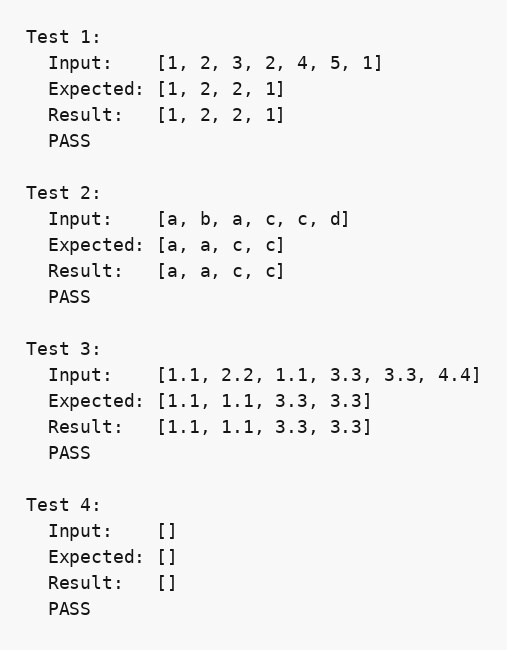

## Парадигма логічного програмування, мова Пролог

### Розділ 1. Варіант 26

### Умова задачі
*Вилучити зі списку елементи, що мають непарну кількість входжень у список.*

### Код програми
```prolog
% part 1 (I-a). 26
% Вилучити зі списку елементи, що мають непарну кількість входжень у список.

count(_, [], 0).
count(X, [X|T], N) :-
    count(X, T, N1),
    N is N1 + 1.
count(X, [Y|T], N) :-
    X \= Y,
    count(X, T, N).

remove_odd_occurrences(List, Result) :-
    remove_odd_occurrences(List, List, Result).

remove_odd_occurrences([], _, []).
remove_odd_occurrences([H|T], Full, Result) :-
    count(H, Full, N),
    remove_odd_occurrences(T, Full, Rest),
    ( 0 is N mod 2 -> Result = [H|Rest] ; Result = Rest ).

show_array(List) :-
    write('['),
    write_elements(List),
    write(']').

write_elements([]).
write_elements([X]) :- write(X).
write_elements([H|T]) :-
    write(H), write(', '),
    write_elements(T).

run_test(N, Input, Expected) :-
    remove_odd_occurrences(Input, Result),
    format("Test ~w:~n", [N]),
    write("  Input:    "), show_array(Input), nl,
    write("  Expected: "), show_array(Expected), nl,
    write("  Result:   "), show_array(Result), nl,
    ( Result = Expected -> write("  PASS\n\n") ; write("  FAIL\n\n") ).

main :-
    run_test(1, [1,2,3,2,4,5,1], [1,2,2,1]),
    run_test(2, [a,b,a,c,c,d], [a,a,c,c]),
    run_test(3, [1.1,2.2,1.1,3.3,3.3,4.4], [1.1,1.1,3.3,3.3]),
    run_test(4, [], []).
```

### Опис алгоритму

Предикат `count/3` рекурсивно переглядає список і підраховує кількість входжень заданого елемента. Предикат `remove_odd_occurrences/2` зберігає повний початковий список, а потім послідовно обробляє кожен його елемент. Елемент включається до результату, якщо кількість його входжень у повний список є парною.

Алгоритм зберігає порядок і всі копії значень із парною частотою. Через повторний підрахунок для кожного елемента часова складність становить `O(n²)`, а список результату потребує `O(n)` пам'яті.

### Обґрунтування завершуваності

У кожному рекурсивному виклику `count/3` та `remove_odd_occurrences/3` обробляється голова списку, а наступний виклик отримує коротший хвіст. Для скінченного списку обидві рекурсії неминуче досягають базового правила з порожнім списком.

### Опис рекурсивного процесу

1. Черговий елемент `H` береться з голови списку.
2. Предикат `count/3` підраховує його входження у повному списку.
3. Рекурсивно будується результат для хвоста.
4. Якщо кількість входжень парна, `H` додається перед результатом хвоста; інакше пропускається.

### Умови тестів

1. Змішаний список чисел перевіряє вилучення значень із непарною частотою.
2. Список атомів перевіряє роботу алгоритму не лише з числами.
3. Список дробових чисел перевіряє інший числовий тип.
4. Порожній список перевіряє базове правило рекурсії.

### Результати тестів

