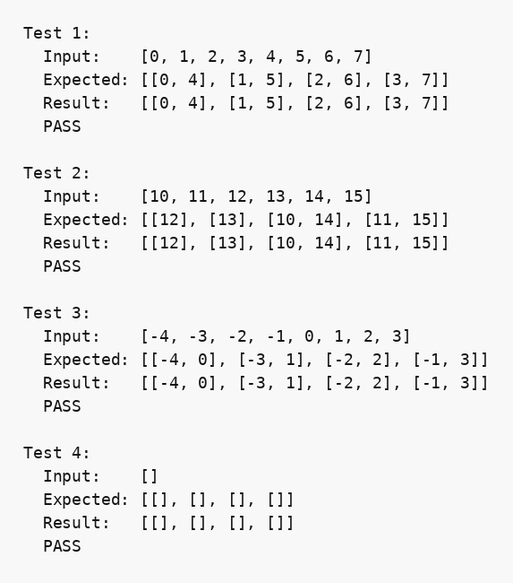

## Парадигма логічного програмування, мова Пролог

### Розділ 1. Варіант 64

### Умова задачі
*Розбити список на чотири списки відповідно з числами, що мають вигляд 4k, 4k+1, 4k+2 та 4k+3.*

### Код програми
```prolog
% part 1 (I-b). 64
% Розбити список на чотири списки відповідно з числами, що мають вигляд 4k, 4k+1, 4k+2 та 4k+3.

split_by_remainder4(List, [R0, R1, R2, R3]) :-
    collect_by_remainder(0, List, R0),
    collect_by_remainder(1, List, R1),
    collect_by_remainder(2, List, R2),
    collect_by_remainder(3, List, R3).

collect_by_remainder(_, [], []).
collect_by_remainder(R, [H|T], [H|Result]) :-
    R =:= H mod 4,
    collect_by_remainder(R, T, Result).
collect_by_remainder(R, [H|T], Result) :-
    R =\= H mod 4,
    collect_by_remainder(R, T, Result).

show_array(List) :-
    write('['),
    write_elements(List),
    write(']').

write_elements([]).
write_elements([X]) :- write(X).
write_elements([H|T]) :-
    write(H), write(', '),
    write_elements(T).

show_2d_array(List) :-
    write('['),
    write_2d_elements(List),
    write(']').

write_2d_elements([]).
write_2d_elements([X]) :- show_array(X).
write_2d_elements([H|T]) :-
    show_array(H), write(', '),
    write_2d_elements(T).

run_test(N, Input, Expected) :-
    split_by_remainder4(Input, Result),
    format("Test ~w:~n", [N]),
    write("  Input:    "), show_array(Input), nl,
    write("  Expected: "), show_2d_array(Expected), nl,
    write("  Result:   "), show_2d_array(Result), nl,
    ( Result = Expected -> write("  PASS\n\n") ; write("  FAIL\n\n") ).

main :-
    run_test(1, [0,1,2,3,4,5,6,7], [[0,4], [1,5], [2,6], [3,7]]),
    run_test(2, [10,11,12,13,14,15], [[12], [13], [10,14], [11,15]]),
    run_test(3, [-4,-3,-2,-1,0,1,2,3], [[-4,0], [-3,1], [-2,2], [-1,3]]),
    run_test(4, [], [[], [], [], []]).
```

### Результати тестів

