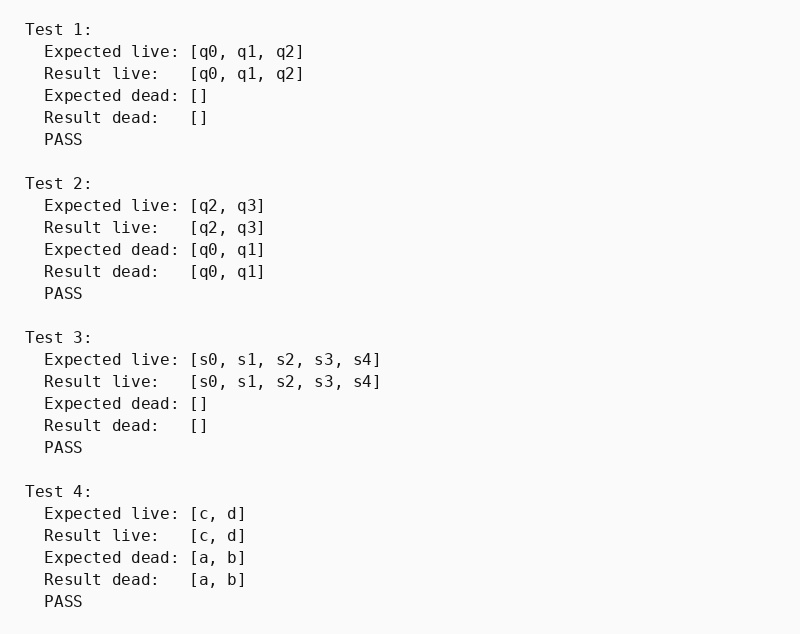

## Парадигма логічного програмування, мова Пролог

### Розділ 3. Варіант 2, задача 1

### Умова задачі
*Виявити живі та мертві стани скінченого автомату.*

### Код програми
```prolog
% part 3. Variant 2, task 1
% Виявити живі та мертві стани скінченого автомату.

:- discontiguous state/2.
:- discontiguous final/2.
:- discontiguous transition/4.

list_difference([], _, []).
list_difference([H|T], Remove, Result) :-
    member(H, Remove),
    list_difference(T, Remove, Result).
list_difference([H|T], Remove, [H|Result]) :-
    \+ member(H, Remove),
    list_difference(T, Remove, Result).

live_states(TestID, LiveStates) :-
    findall(F, final(TestID, F), Finals),
    traverse_reverse(TestID, Finals, [], Visited),
    sort(Visited, LiveStates).

dead_states(TestID, DeadStates) :-
    live_states(TestID, Live),
    findall(S, state(TestID, S), AllStatesUnsorted),
    sort(AllStatesUnsorted, AllStates),
    list_difference(AllStates, Live, DeadStates).

traverse_reverse(_, [], Visited, Visited).
traverse_reverse(TestID, [Current|Rest], Visited, Result) :-
    member(Current, Visited),
    traverse_reverse(TestID, Rest, Visited, Result).
traverse_reverse(TestID, [Current|Rest], Visited, Result) :-
    \+ member(Current, Visited),
    findall(Prev, transition(TestID, Prev, _, Current), Predecessors),
    append(Predecessors, Rest, NewFrontier),
    traverse_reverse(TestID, NewFrontier, [Current|Visited], Result).

% test 1
state(test1, q0).
state(test1, q1).
state(test1, q2).
final(test1, q2).
transition(test1, q0, a, q1).
transition(test1, q1, b, q2).

% test 2
state(test2, q0).
state(test2, q1).
state(test2, q2).
state(test2, q3).
final(test2, q3).
transition(test2, q0, a, q1).
transition(test2, q1, a, q1).
transition(test2, q2, b, q3).

% test 3
state(test3, s0).
state(test3, s1).
state(test3, s2).
state(test3, s3).
state(test3, s4).
final(test3, s2).
final(test3, s4).
transition(test3, s0, a, s1).
transition(test3, s1, b, s2).
transition(test3, s2, b, s2).
transition(test3, s3, c, s4).

% test 4
state(test4, a).
state(test4, b).
state(test4, c).
state(test4, d).
final(test4, d).
transition(test4, a, '0', b).
transition(test4, b, '1', a).
transition(test4, c, '0', d).

show_array(List) :-
    write('['),
    write_elements(List),
    write(']').

write_elements([]).
write_elements([X]) :- write(X).
write_elements([H|T]) :-
    write(H), write(', '),
    write_elements(T).

run_test(N, TestID, ExpectedLive, ExpectedDead) :-
    live_states(TestID, Live),
    dead_states(TestID, Dead),
    format("Test ~w:~n", [N]),
    write("  Expected live: "), show_array(ExpectedLive), nl,
    write("  Result live:   "), show_array(Live), nl,
    write("  Expected dead: "), show_array(ExpectedDead), nl,
    write("  Result dead:   "), show_array(Dead), nl,
    ( Live = ExpectedLive, Dead = ExpectedDead -> write("  PASS\n\n") ; write("  FAIL\n\n") ).

main :-
    run_test(1, test1, [q0,q1,q2], []),
    run_test(2, test2, [q2,q3], [q0,q1]),
    run_test(3, test3, [s0,s1,s2,s3,s4], []),
    run_test(4, test4, [c,d], [a,b]).
```

### Опис алгоритму

Живим є стан, з якого можна дістатися хоча б одного заключного стану. Предикат `live_states/2` збирає всі заключні стани та запускає з них зворотний обхід графа переходів. Для поточного стану предикат `traverse_reverse/4` знаходить усіх попередників, тобто стани, з яких існує перехід до поточного.

Список `Visited` запобігає повторній обробці станів і нескінченному обходу циклів. Мертві стани обчислюються як різниця між усіма станами автомата та множиною живих.

### Обґрунтування завершуваності

Кількість станів і переходів автомата скінченна. Кожний стан додається до `Visited` не більше одного разу. Повторно знайдений стан вилучається з фронту без розширення. Тому після обробки всіх зворотно досяжних станів фронт стає порожнім і рекурсія завершується.

### Опис ітеративного процесу

1. Початковий фронт містить усі заключні стани, а `Visited` є порожнім.
2. Із фронту береться поточний стан.
3. Якщо він уже відвіданий, алгоритм переходить до наступного стану.
4. Інакше знаходяться всі його попередники, додаються до фронту, а стан — до `Visited`.
5. Після спорожнення фронту невідвідані стани визначаються як мертві.

### Тестові сценарії

| Вхідні дані | Очікуваний результат | Що перевіряє тест |
|---|---|---|
| `test1`: лінійний шлях до `q2` | Живі: `q0,q1,q2`; мертвих немає | Зворотне поширення живості через усі переходи |
| `test2`: цикл `q0,q1` без шляху до `q3` | Живі: `q2,q3`; мертві: `q0,q1` | Визначення мертвої компоненти |
| `test3`: два заключні стани | Усі стани живі | Обхід від кількох фінальних станів |
| `test4`: цикл `a,b` і шлях `c -> d` | Живі: `c,d`; мертві: `a,b` | Цикл без шляху до фіналу та завершення обходу |

### Ілюстрація результатів тестування

Зображення є ілюстрацією одного запуску. Актуальна перевірка виконується командою `swipl -q -s main.pl -g main -t halt`.


