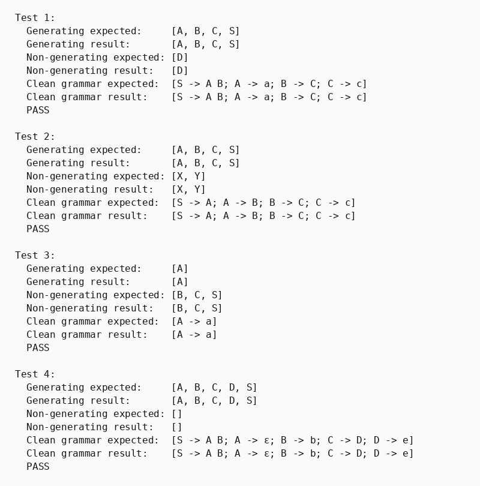

## Парадигма логічного програмування, мова Пролог

### Розділ 4. Варіант 2, задача 1

### Умова задачі
*Виявити породжуючі та непороджуючі нетермінали. Забезпечити еквівалентне перетворення граматики з метою елімінації непороджуючих нетерміналів.*

### Код програми
```prolog
% part 4. Variant 2, task 1
% Виявити породжуючі та непороджуючі нетермінали. Елімінувати непороджуючі нетермінали.

:- discontiguous rule/3.

rhs_nonterminals([], []).
rhs_nonterminals([nt(N)|T], [N|Rest]) :-
    rhs_nonterminals(T, Rest).
rhs_nonterminals([t(_)|T], Rest) :-
    rhs_nonterminals(T, Rest).

all_nonterminals(TestID, Nonterminals) :-
    findall(LHS, rule(TestID, LHS, _), LHSs),
    findall(N, (rule(TestID, _, RHS), rhs_nonterminals(RHS, Ns), member(N, Ns)), RHSs),
    append(LHSs, RHSs, All),
    sort(All, Nonterminals).

generating_nonterminals(TestID, Generating) :-
    fixed_point_generating(TestID, [], Generating).

fixed_point_generating(TestID, Current, Final) :-
    step_generating(TestID, Current, Next),
    ( Current = Next -> Final = Current ; fixed_point_generating(TestID, Next, Final) ).

step_generating(TestID, Current, Next) :-
    findall(LHS, (
        rule(TestID, LHS, RHS),
        rhs_generating(RHS, Current)
    ), New),
    append(Current, New, Both),
    sort(Both, Next).

rhs_generating([], _).
rhs_generating([t(_)|T], Current) :-
    rhs_generating(T, Current).
rhs_generating([nt(N)|T], Current) :-
    member(N, Current),
    rhs_generating(T, Current).

list_difference([], _, []).
list_difference([H|T], Remove, Result) :-
    member(H, Remove),
    list_difference(T, Remove, Result).
list_difference([H|T], Remove, [H|Result]) :-
    \+ member(H, Remove),
    list_difference(T, Remove, Result).

non_generating_nonterminals(TestID, NonGenerating) :-
    all_nonterminals(TestID, All),
    generating_nonterminals(TestID, Generating),
    list_difference(All, Generating, NonGenerating).

cleaned_rules(TestID, Cleaned) :-
    generating_nonterminals(TestID, Generating),
    findall(rule(LHS, RHS), (
        rule(TestID, LHS, RHS),
        member(LHS, Generating),
        rhs_generating(RHS, Generating)
    ), Cleaned).

% test 1
rule(test1, 'S', [nt('A'), nt('B')]).
rule(test1, 'A', [t(a)]).
rule(test1, 'B', [nt('C')]).
rule(test1, 'C', [t(c)]).
rule(test1, 'D', [nt('D')]).

% test 2
rule(test2, 'S', [nt('A')]).
rule(test2, 'A', [nt('B')]).
rule(test2, 'B', [nt('C')]).
rule(test2, 'C', [t(c)]).
rule(test2, 'X', [nt('Y')]).
rule(test2, 'Y', [nt('X')]).

% test 3
rule(test3, 'S', [nt('A'), nt('B')]).
rule(test3, 'A', [t(a)]).
rule(test3, 'B', [nt('C')]).
rule(test3, 'C', [nt('B')]).

% test 4
rule(test4, 'S', [nt('A'), nt('B')]).
rule(test4, 'A', []).
rule(test4, 'B', [t(b)]).
rule(test4, 'C', [nt('D')]).
rule(test4, 'D', [t(e)]).

show_array(List) :-
    write('['),
    write_elements(List),
    write(']').

write_elements([]).
write_elements([X]) :- write(X).
write_elements([H|T]) :-
    write(H), write(', '),
    write_elements(T).

show_symbol(t(X)) :- write(X).
show_symbol(nt(X)) :- write(X).

show_rhs([]) :- write('ε').
show_rhs([X]) :- show_symbol(X).
show_rhs([H|T]) :-
    show_symbol(H), write(' '),
    show_rhs(T).

show_rule(rule(LHS, RHS)) :-
    write(LHS), write(' -> '), show_rhs(RHS).

show_rules(List) :-
    write('['),
    write_rule_list(List),
    write(']').

write_rule_list([]).
write_rule_list([X]) :- show_rule(X).
write_rule_list([H|T]) :-
    show_rule(H), write('; '),
    write_rule_list(T).

run_test(N, TestID, ExpectedGen, ExpectedNonGen, ExpectedClean) :-
    generating_nonterminals(TestID, Gen),
    non_generating_nonterminals(TestID, NonGen),
    cleaned_rules(TestID, Clean),
    format("Test ~w:~n", [N]),
    write("  Generating expected:     "), show_array(ExpectedGen), nl,
    write("  Generating result:       "), show_array(Gen), nl,
    write("  Non-generating expected: "), show_array(ExpectedNonGen), nl,
    write("  Non-generating result:   "), show_array(NonGen), nl,
    write("  Clean grammar expected:  "), show_rules(ExpectedClean), nl,
    write("  Clean grammar result:    "), show_rules(Clean), nl,
    ( Gen = ExpectedGen, NonGen = ExpectedNonGen, Clean = ExpectedClean -> write("  PASS\n\n") ; write("  FAIL\n\n") ).

main :-
    run_test(1, test1,
        ['A', 'B', 'C', 'S'], ['D'],
        [rule('S', [nt('A'), nt('B')]), rule('A', [t(a)]), rule('B', [nt('C')]), rule('C', [t(c)])]),

    run_test(2, test2,
        ['A', 'B', 'C', 'S'], ['X', 'Y'],
        [rule('S', [nt('A')]), rule('A', [nt('B')]), rule('B', [nt('C')]), rule('C', [t(c)])]),

    run_test(3, test3,
        ['A'], ['B', 'C', 'S'],
        [rule('A', [t(a)])]),

    run_test(4, test4,
        ['A', 'B', 'C', 'D', 'S'], [],
        [rule('S', [nt('A'), nt('B')]), rule('A', []), rule('B', [t(b)]), rule('C', [nt('D')]), rule('D', [t(e)])]).
```

### Опис алгоритму

Предикат `generating_nonterminals/2` обчислює породжуючі нетермінали методом нерухомої точки. На початку множина порожня. Предикат `step_generating/3` додає ліву частину кожного правила, права частина якого складається лише з терміналів або вже відомих породжуючих нетерміналів.

Після стабілізації множини предикат `non_generating_nonterminals/2` знаходить різницю між усіма нетерміналами та породжуючими. `cleaned_rules/2` залишає лише правила з породжуючою лівою та правою частинами.

### Обґрунтування завершуваності

Граматика має скінченну кількість нетерміналів. Кожний крок нерухомої точки може тільки додавати нові елементи до поточної множини. Коли нових породжуючих нетерміналів немає, `Current` і `Next` збігаються, після чого рекурсія завершується.

### Опис ітеративного процесу

1. Нульова ітерація починається з порожньої множини.
2. Для кожного правила перевіряється предикат `rhs_generating/2`.
3. Породжуючі ліві частини додаються до поточної множини та сортуються.
4. Ітерації повторюються до отримання однакових `Current` і `Next`.
5. На основі кінцевої множини формуються список непороджуючих символів і очищена граматика.

### Умови тестів

1. Саморекурсивний нетермінал без термінального правила перевіряє базове вилучення.
2. Взаємно рекурсивна непороджуюча компонента перевіряє цикл без термінального завершення.
3. Залежність стартового символу від непороджуючого циклу перевіряє каскадне вилучення правил.
4. Порожнє правило та повністю породжуюча граматика перевіряють `ε`-виведення.

### Результати тестів

