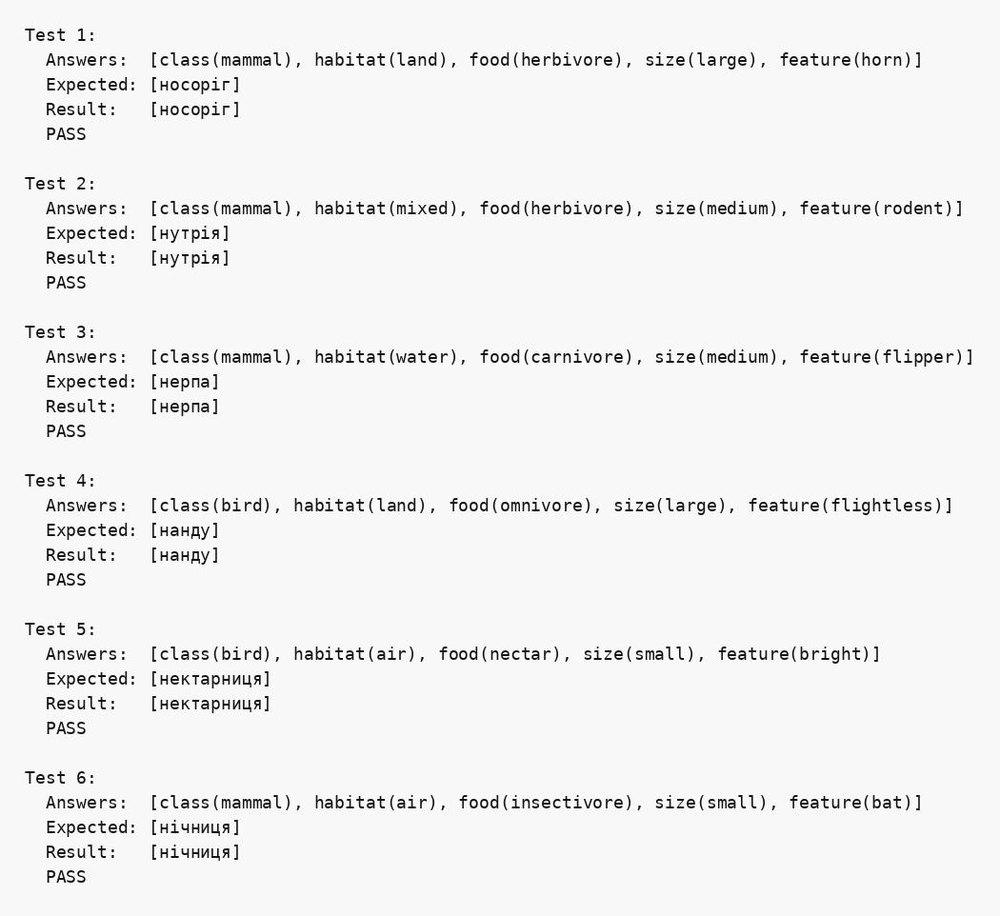

## Парадигма логічного програмування, мова Пролог

### Розділ 6. Варіант: літера Н

### Умова задачі
*Розробити просту експертну систему: не менше 8 об’єктів, що ідентифікуються, назви яких починаються з літери Н; використати класифікатори та вибір з трьох або більше альтернатив.*

### Код програми
```prolog
% part 6. Variant: letter Н
% Проста експертна система для визначення тварини на літеру "Н".

:- encoding(utf8).

% animal(Name, Class, Habitat, Food, Size, SpecialFeature).
% Назви всіх об'єктів починаються з літери Н.
animal('носоріг',    mammal, land,  herbivore, large,  horn).
animal('нутрія',     mammal, mixed, herbivore, medium, rodent).
animal('нерпа',      mammal, water, carnivore, medium, flipper).
animal('норка',      mammal, mixed, carnivore, small,  fur_predator).
animal('нанду',      bird,   land,  omnivore,  large,  flightless).
animal('носуха',     mammal, land,  omnivore,  medium, long_nose).
animal('нектарниця', bird,   air,   nectar,    small,  bright).
animal('нічниця',    mammal, air,   insectivore, small, bat).

% Узагальнюючі поняття і класифікатори.
classifier(class, mammal, 'ссавець').
classifier(class, bird, 'птах').
classifier(habitat, land, 'суходіл').
classifier(habitat, water, 'вода').
classifier(habitat, mixed, 'суходіл і вода').
classifier(habitat, air, 'повітря').
classifier(food, herbivore, 'травоїдна').
classifier(food, carnivore, 'хижак').
classifier(food, omnivore, 'всеїдна').
classifier(food, nectar, 'живиться нектаром').
classifier(food, insectivore, 'живиться комахами').
classifier(size, small, 'мала').
classifier(size, medium, 'середня').
classifier(size, large, 'велика').

% Питання з трьома або більше альтернативами.
question(class, 'Клас тварини', [mammal, bird]).
question(habitat, 'Середовище існування', [land, water, mixed, air]).
question(food, 'Тип живлення', [herbivore, carnivore, omnivore, nectar, insectivore]).
question(size, 'Розмір', [small, medium, large]).
question(feature, 'Особлива ознака', [horn, rodent, flipper, fur_predator, flightless, long_nose, bright, bat]).

matches(Required, Answers) :-
    member(Required, Answers).

identify(Answers, Result) :-
    findall(Name, (
        animal(Name, Class, Habitat, Food, Size, Feature),
        matches(class(Class), Answers),
        matches(habitat(Habitat), Answers),
        matches(food(Food), Answers),
        matches(size(Size), Answers),
        matches(feature(Feature), Answers)
    ), Result).

ask_value(Key, Value) :-
    question(Key, Text, Options),
    format('~w ~w:~n', [Text, Options]),
    read(Value),
    member(Value, Options).

start :-
    ask_value(class, Class),
    ask_value(habitat, Habitat),
    ask_value(food, Food),
    ask_value(size, Size),
    ask_value(feature, Feature),
    identify([class(Class), habitat(Habitat), food(Food), size(Size), feature(Feature)], Result),
    write('Результат: '), show_array(Result), nl.

show_array(List) :-
    write('['),
    write_elements(List),
    write(']').

write_elements([]).
write_elements([X]) :- write(X).
write_elements([H|T]) :-
    write(H), write(', '),
    write_elements(T).

run_test(N, Answers, Expected) :-
    identify(Answers, Result),
    format('Test ~w:~n', [N]),
    write('  Answers:  '), show_array(Answers), nl,
    write('  Expected: '), show_array(Expected), nl,
    write('  Result:   '), show_array(Result), nl,
    ( Result = Expected -> write('  PASS\n\n') ; write('  FAIL\n\n') ).

main :-
    run_test(1,
        [class(mammal), habitat(land), food(herbivore), size(large), feature(horn)],
        ['носоріг']),
    run_test(2,
        [class(mammal), habitat(mixed), food(herbivore), size(medium), feature(rodent)],
        ['нутрія']),
    run_test(3,
        [class(mammal), habitat(water), food(carnivore), size(medium), feature(flipper)],
        ['нерпа']),
    run_test(4,
        [class(bird), habitat(land), food(omnivore), size(large), feature(flightless)],
        ['нанду']),
    run_test(5,
        [class(bird), habitat(air), food(nectar), size(small), feature(bright)],
        ['нектарниця']),
    run_test(6,
        [class(mammal), habitat(air), food(insectivore), size(small), feature(bat)],
        ['нічниця']).
```

### Опис бази знань та алгоритму

База знань містить факти `animal/6` для восьми тварин, назви яких починаються з літери «Н». Кожний факт описує клас, середовище існування, тип живлення, розмір та особливу ознаку тварини. Предикати `question/3` і `classifier/3` задають допустимі категорії та їхні текстові описи.

Предикат `identify/2` перебирає факти про тварин за допомогою `findall/3` і залишає лише ті, для яких кожна характеристика присутня у списку відповідей. Інтерактивний предикат `start/0` послідовно запитує значення всіх характеристик, перевіряє їх за списком допустимих варіантів та передає сформовані відповіді до `identify/2`.

### Обґрунтування завершуваності

Кількість питань, варіантів відповідей і фактів `animal/6` є скінченною. Після отримання п'яти допустимих відповідей `findall/3` переглядає скінченну базу знань і завершує пошук. Автоматичні тести не містять рекурсивних викликів і також завершуються після перевірки всіх фактів.

### Опис процесу логічного виведення

1. Користувач обирає клас, середовище, живлення, розмір та особливу ознаку.
2. Відповіді подаються як терми `class(...)`, `habitat(...)`, `food(...)`, `size(...)` і `feature(...)`.
3. Для кожного факту `animal/6` перевіряється наявність усіх необхідних термів у відповідях.
4. Імена фактів, що пройшли всі перевірки, збираються у список результату.
5. Якщо жодний факт не відповідає характеристикам, повертається порожній список.

### Умови тестів

1. Носоріг перевіряє велику травоїдну наземну тварину з рогом.
2. Нутрія перевіряє ссавця зі змішаним середовищем існування.
3. Нерпа перевіряє водного хижого ссавця.
4. Нанду перевіряє великого нелітаючого птаха.
5. Нектарниця перевіряє малого птаха, що живиться нектаром.
6. Нічниця перевіряє комахоїдного ссавця, пристосованого до польоту.

### Приклад інтерактивного запуску

```prolog
?- start.
```

Для автоматичного виконання тестів використовується команда:

```bash
swipl -s main.pl -g main -t halt
```

### Результати тестів

